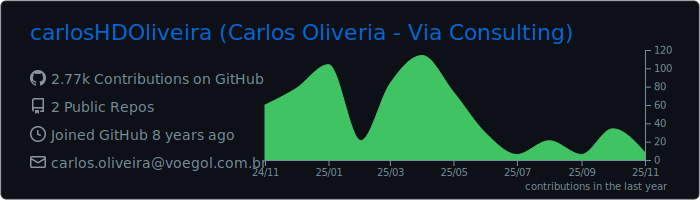
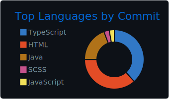
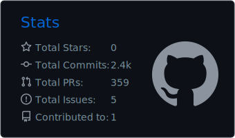
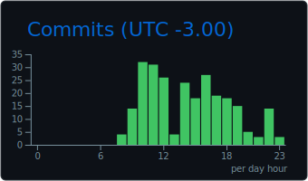

<h2>Olá! Eu sou o Carlos Henrique 👋</h2>

Dev Full-Stack • PHP/Laravel • Vue/React/Next • Docker/Linux

  
  

---

### Estatísticas

  <!-- Detalhes gerais -->
  
  <!-- Linguagens por commits (não por bytes) -->
  

  <!-- Stats compactas -->
  
  <!-- Horário mais produtivo -->
  

---

### Tecnologias que uso

  <!-- Back-end -->
  <strong>Back‑end</strong> 
  

   

  <!-- Front-end -->
  <strong>Front‑end</strong> 
  

   

  
  <!-- Bancos de dados -->
  <strong>Bancos de dados</strong> 
  
  

   

  <!-- Infra / DevOps -->
  <strong>Infra / DevOps</strong> 
  

   

  <!-- Painéis & extras (badges via Shields.io) -->
  <strong>Painéis & extras</strong> 
  
  
  

