<h1 align="center">Fala! Eu sou o Carlos Henrique 👋</h1>

Dev <b>Full‑Stack</b> focado em JS/TS • apaixonado por DX e boas práticas

  
  

### 🧠 Linguagens (por commits)

---

### ⚙️ Tecnologias que uso
<!-- Skill Icons -->

